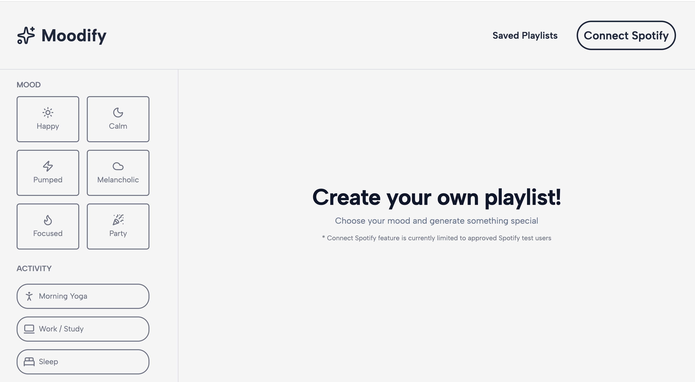
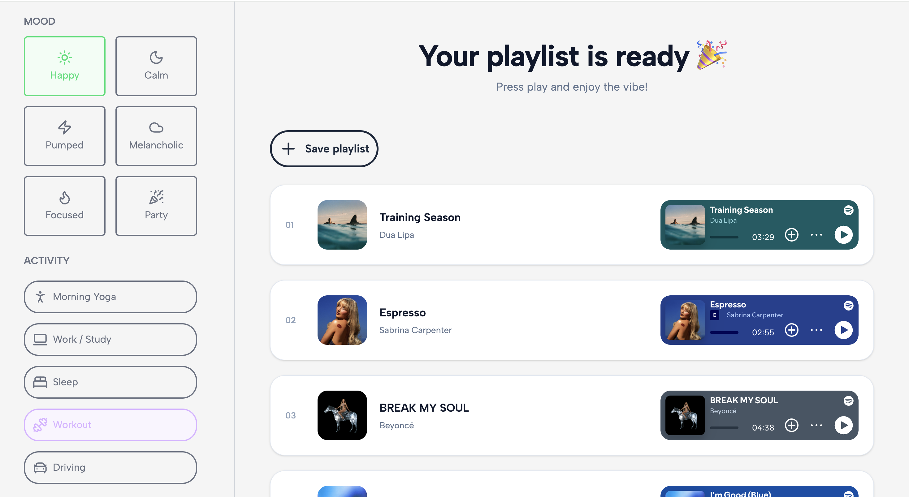
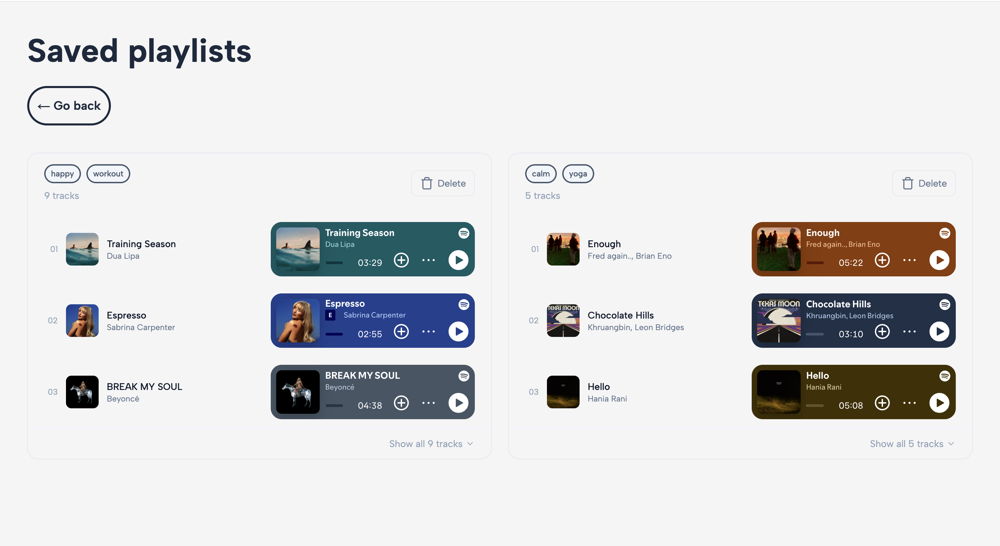

# 🎵 Moodify - Your perfect playlist generator

A mood-based playlist generator that creates personalized Spotify playlists using AI. Tell Moodify how you feel — it handles the rest.

Built with a focus on AI integration, music discovery, and a smooth user experience using modern frontend technologies.

---

## 🚀 Live Demo

Try the app here:  
👉 https://usemoodify.netlify.app/

---

## 📖 About the Project

Moodify is a web application that generates personalized playlists based on your current mood, activity, and energy level.

Users can:

- select their mood, activity, and energy level
- get an AI-generated playlist tailored to their input
- preview tracks directly in the app via Spotify embeds
- save playlists locally and revisit them anytime
- connect their Spotify account *(developer mode — currently limited to authorized accounts)*

This project was built to strengthen skills in:

- Next.js App Router
- TypeScript
- AI API integration
- Third-party API integration
- Component-based architecture
- Responsive UI design

---

## ✨ Features

### 🎭 Mood-Based Input
Users customize their listening experience by selecting:

- **Mood** — e.g. happy, melancholic, party
- **Activity** — e.g. studying, working out, relaxing
- **Energy level** — low, medium, high

---

### 🤖 AI-Powered Playlist Generation

User input is assembled into a prompt and sent to the **Gemini API**, which returns a curated list of track recommendations tailored to the mood profile.

---

### 🎧 Spotify Integration

Generated tracks are fetched from the **Spotify API** and rendered with embedded players — no need to leave the app to preview songs.

---

### 💾 Saved Playlists

Users can save any generated playlist locally. Saved playlists are stored in `localStorage` and accessible anytime from the Saved Playlists page.

---

### 🔐 Spotify Login

Users can connect their Spotify account via **NextAuth**.

> ⚠️ The app is currently in Spotify's developer mode. Only explicitly authorized accounts can log in. This limitation is noted in the app UI.

---

### 📱 Fully Responsive Design

Optimized for:

- mobile
- tablet
- desktop

---

## 🛠 Built With

- Next.js
- TypeScript
- React
- Tailwind CSS
- Gemini API
- Spotify API
- NextAuth.js

---

## ⚙️ Installation

Run locally:

```bash
git clone https://github.com/daryna-budz/moodify.git
cd moodify
npm install
npm run dev
```

---

## 🔑 Environment Variables

Create a `.env.local` file:

```env
SPOTIFY_CLIENT_ID=your_spotify_client_id
SPOTIFY_CLIENT_SECRET=your_spotify_client_secret
GEMINI_API_KEY=your_gemini_api_key
NEXTAUTH_SECRET=your_nextauth_secret
NEXTAUTH_URL=http://localhost:3000
```

---

## 📦 Deployment

To build the project:

```bash
npm run build
```

---

## 📸 Preview

### Home Page


### Playlist Page


### Saved Playlists


---

## 🎯 Learning Outcomes

Through this project I practiced:

- integrating AI APIs into a real product flow
- working with the Spotify API and OAuth
- managing application state and localStorage
- building reusable UI components
- structuring scalable Next.js applications

---

If you liked this project, feel free to ⭐ the repository.